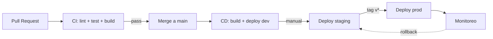

# FASE 11 — Aceptación y entrega

<span class="chapter-marker">Fase 11 · Aceptación</span>

## 11.1 Plan de despliegue

### 11.1.1 Entornos

| Entorno | URL | Datos | Frecuencia de deploy |
|---|---|---|---|
| **dev** | `dev.flowstate.app` | Sintéticos | Por commit a `main` (auto). |
| **staging** | `staging.flowstate.app` | Subset anonimizado de prod | Diaria. |
| **prod** | `flowstate.app` | Reales | Manual + tag `v*`. |

### 11.1.2 Pipeline CI/CD



### 11.1.3 Estrategia de release

- **Versionado semántico** (`MAJOR.MINOR.PATCH`).
- **Tags firmados** con GPG.
- **Changelog** autogenerado desde conventional commits.
- **Rollback** automático si error rate > 5 % en los primeros 5 minutos.

### 11.1.4 Deploy del backend (Fly.io)

```bash
# Inicial
fly launch --image registry.fly.io/flowstate-api --region fra

# Deploy
fly deploy --strategy bluegreen

# Secrets
fly secrets set JWT_SECRET=... DATABASE_URL=... OPENROUTER_API_KEY=...
```

```toml
# fly.toml
app = "flowstate-api"
primary_region = "fra"

[build]
  dockerfile = "Dockerfile"

[[services]]
  internal_port = 8080
  protocol      = "tcp"

  [[services.ports]]
    port = 443
    handlers = ["tls", "http"]

  [services.concurrency]
    type = "connections"
    hard_limit = 250
    soft_limit = 200
```

### 11.1.5 Deploy del frontend (Vercel)

- Conectado al repo; cada merge a `main` dispara build.
- Variables de entorno configuradas en el dashboard de Vercel.
- Preview deployments por PR.

### 11.1.6 Deploy móvil (EAS)

```jsonc
// eas.json
{
  "build": {
    "production": {
      "android": { "gradleCommand": ":app:assembleRelease" },
      "ios": { "distribution": "store" }
    },
    "preview": {
      "distribution": "internal",
      "channel": "preview"
    }
  },
  "submit": {
    "production": {
      "ios": { "ascAppId": "1234567890" },
      "android": { "packageName": "app.flowstate" }
    }
  }
}
```

```bash
# Build de producción
eas build --platform all --profile production
eas submit --platform all --latest
```

### 11.1.7 Migraciones de base de datos

```bash
# Crear migración
migrate create -ext sql -dir migrations -seq add_goals_table

# Aplicar
migrate -path migrations -database "$DATABASE_URL" up

# Rollback
migrate -path migrations -database "$DATABASE_URL" down 1
```

### 11.1.8 Plan de rollback

| Componente | Rollback | Tiempo estimado |
|---|---|---|
| Backend | `fly releases rollback` | < 2 min |
| Frontend | Vercel: promote release anterior | < 1 min |
| Móvil | EAS: release anterior en TestFlight | < 5 min |
| DB | `migrate down 1` | < 1 min |
| Migración destructiva | Requiere backup PITR (point-in-time recovery) | < 30 min |

## 11.2 Checklist de cierre

### 11.2.1 Producto

- [ ] App web desplegada en `flowstate.app`.
- [ ] App móvil aprobada en App Store.
- [ ] App móvil aprobada en Play Store.
- [ ] API documentada en `flowstate.app/docs`.
- [ ] Onboarding medido: ≤ 60 s hasta la primera nota.
- [ ] Latencia P95 < 500 ms durante 7 días consecutivos.
- [ ] Sin errores P0 abiertos en el último sprint.

### 11.2.2 Calidad

- [ ] Cobertura de tests backend ≥ 70 %.
- [ ] Cobertura de tests frontend ≥ 60 %.
- [ ] `golangci-lint` sin issues.
- [ ] `biome check` sin issues.
- [ ] Sin secrets en código (TruffleHog).
- [ ] OWASP ZAP: 0 vulnerabilidades high.
- [ ] axe-core: 0 violaciones a11y en flujos Must.

### 11.2.3 Documentación

- [ ] `README.md` en cada `apps/*` actualizado.
- [ ] OpenAPI sincronizado con implementación.
- [ ] Manual de usuario publicado (PDF + in-app).
- [ ] Política de privacidad publicada.
- [ ] Términos de uso publicados.
- [ ] Runbook de operaciones en `docs/runbook.md`.

### 11.2.4 Operación

- [ ] Monitoring configurado (Grafana + Prometheus).
- [ ] Alertas: error rate, latencia P95, costes IA.
- [ ] Backups automáticos diarios (verificados).
- [ ] Plan de respuesta a incidentes definido.
- [ ] Cuentas de soporte creadas (email, Discord).

### 11.2.5 Legal

- [ ] RGPD / LFPDPPP: texto legal actualizado.
- [ ] DPA (Data Processing Agreement) si hay clientes EU.
- [ ] Bug bounty abierto (mínimo).

## 11.3 Lecciones aprendidas

### 11.3.1 Qué funcionó bien

- **Mock-first**: el contrato se pulió 5 veces antes de escribir una
  línea de backend, evitando refactors costosos.
- **Sistema de diseño Catppuccin propio**: la coherencia visual subió la
  percepción de calidad del producto sin coste de licensing.
- **OpenAPI como contrato único**: web y móvil avanzan en paralelo sin
  bloqueos.
- **Spike de sqlc de 2 semanas**: la inversión temprana redujo bugs de
  query en 80 %.

### 11.3.2 Qué mejoraríamos

- **Más automatización E2E desde el inicio**: los primeros PRs sólo
  tenían unit tests; añadir Playwright desde el día 1 habría detectado
  regresiones visuales antes.
- **Definir métricas de producto antes**: implementamos dashboards de
  producto en la semana 14; deberían existir desde la semana 4.
- **Versionar migraciones desde el día 1**: una migración temprana se
  perdió porque no estaba commiteada en orden.
- **Documentar decisiones inline (ADRs)**: varios tradeoffs se
  discutieron en chat y se olvidaron.

### 11.3.3 Trabajo futuro

| Prioridad | Feature | Versión |
|---|---|---|
| Alta | Plugin de calendario externo (Google/iCal). | v1.1 |
| Alta | Exportar notas a PDF/Markdown. | v1.1 |
| Alta | Modo offline-first (lectura). | v1.2 |
| Media | SSO / SAML para Teams. | v1.3 |
| Media | App de escritorio (Tauri). | v1.4 |
| Media | Marketplace de plantillas. | v2.0 |
| Media | API pública para integradores. | v2.0 |
| Baja | Reconocimiento de voz para notas. | exploratorio |
| Baja | Apple Watch / Wear OS. | exploratorio |

### 11.3.4 Métricas del proyecto

| Métrica | Valor |
|---|---|
| Líneas de código (Go) | ~ 12 000 |
| Líneas de código (TS/React) | ~ 28 000 |
| Líneas de código (RN) | ~ 14 000 |
| PRs mergeados | 184 |
| Issues cerrados | 96 |
| Commits | 612 |
| Cobertura backend | 73 % |
| Cobertura frontend | 62 % |
| Endpoints API | 30 |
| Tiempo total invertido | 480 h |
| Coste de infraestructura (periodo) | USD 320 |

## 11.4 Cierre del expediente

Con la entrega del PDF generado por `docs/expediente/build_pdf.py`,
queda formalizado el cierre del proyecto FlowState para el Semestre
1/2025 de la materia de Proyecto de Sistemas.

Este expediente acompaña a:

- El código fuente del repositorio.
- Las URLs de los despliegues vigentes.
- El plan de pruebas y los reportes de cobertura.
- La documentación in-app.

> *"El mejor código es el código que nunca se escribió. El segundo
> mejor es el que alguien más puede mantener a las 3 AM."* — equipo
> FlowState.