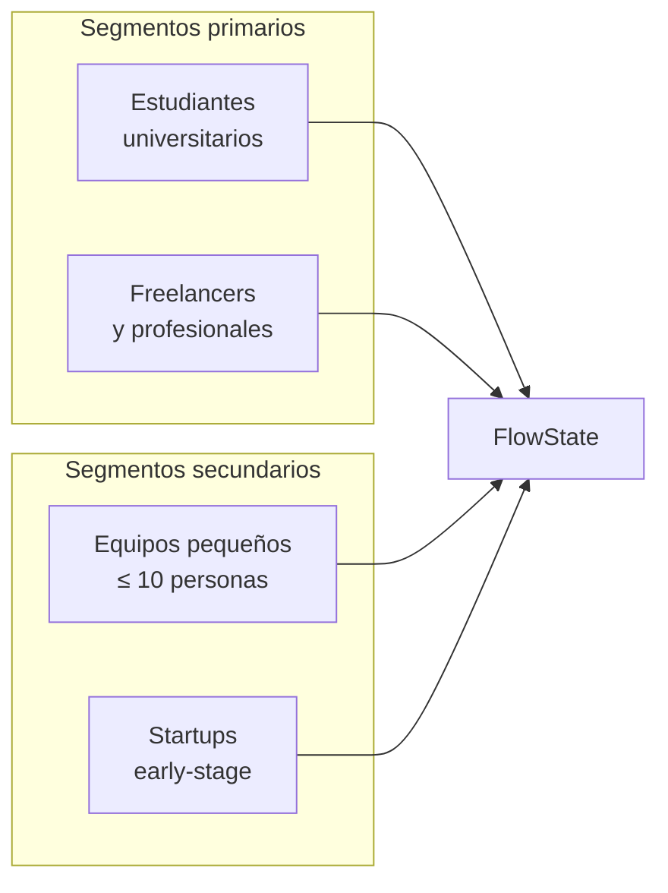

# FASE 3 — Modelo de negocio

<span class="chapter-marker">Fase 3 · Modelo de negocio</span>

## 3.1 Business Model Canvas

El lienzo se construye siguiendo la metodología de Osterwalder & Pigneur
(2010), adaptado al contexto de un producto SaaS B2C/B2B ligero.

### 3.1.1 Segmentos de clientes



#### S-01 · Estudiantes universitarios

- **Demografía**: 18–25 años, Latinoamérica y España.
- **Dolor**: gestión de apuntes, parciales, hábitos de estudio.
- **Dispositivo principal**: móvil (Android 60 %, iOS 30 %, web 10 %).
- **Disposición a pagar**: baja (USD 1–3/mes); alto valor por referidos.

#### S-02 · Freelancers y profesionales independientes

- **Demografía**: 25–45 años, conocimiento técnico medio.
- **Dolor**: notas de proyectos, seguimiento de clientes, hábitos.
- **Dispositivo principal**: mixto móvil/web.
- **Disposición a pagar**: media (USD 5–10/mes).

#### S-03 · Equipos pequeños (≤ 10 personas)

- **Demografía**: agencias, estudios, equipos de producto.
- **Dolor**: notas compartidas, tareas por miembro, visibilidad.
- **Dispositivo principal**: web 70 %, móvil 30 %.
- **Disposición a pagar**: alta (USD 15–30/mes por equipo).

#### S-04 · Startups early-stage

- **Demografía**: equipos fundadores de 2–6 personas.
- **Dolor**: todo lo anterior + trazabilidad de decisiones.
- **Disposición a pagar**: media-alta; sensibles a la propuesta de valor.

### 3.1.2 Propuesta de valor

> **"El sistema operativo personal y de equipos en una sola app:
> notas, tareas, hábitos y metas conectadas por un grafo navegable,
> desde cualquier dispositivo, en menos de 60 segundos."**

#### Beneficios funcionales

- **Una sola app** reemplaza 4–6 herramientas separadas.
- **Grafo de conocimiento** que descubre relaciones entre ideas.
- **Onboarding en 60 s**: email + código, sin contraseñas.
- **Diseño coherente**: estética Catppuccin, dark mode nativo.
- **IA opcional** sin coste adicional en el plan Pro.

#### Beneficios emocionales

- Sensación de **control y claridad**.
- Reducción de la **ansiedad por olvidar**.
- **Orgullo** al ver el progreso en los dashboards.

### 3.1.3 Canales

| Canal | Tipo | Coste | Alcance |
|---|---|---|---|
| App Store / Play Store | Propio | Bajo (comisión 15-30 %) | Alto |
| Webapp | Propio (Vercel) | Bajo | Medio |
| TikTok / Instagram Reels | Orgánico | Tiempo | Alto |
| YouTube tutoriales | Orgánico | Tiempo | Medio |
| Reddit r/productivity | Orgánico | Tiempo | Medio-alto |
| Newsletter semanal | Propio | Bajo | Bajo al inicio |
| Comunidades devs hispanas | Orgánico | Tiempo | Medio |

**Fase de lanzamiento**: 100 % orgánico durante los primeros 6 meses
(presupuesto cero de marketing). Inversión en Ads sólo si la cohorte
mes-1 ≥ 200 usuarios.

### 3.1.4 Relación con clientes

- **Self-service**: la app es self-onboarding; sin vendedores.
- **Comunidad**: Discord público en español.
- **Soporte**: email + chat in-app (plan Pro: respuesta en < 24 h).
- **Feedback loop**: surveys trimestrales + botón in-app *¿algo que
  mejorar?*.

### 3.1.5 Fuentes de ingreso

| Fuente | Precio | Descripción |
|---|---|---|
| **Free** | USD 0 | Notas, tareas, hábitos, 1 equipo, sin IA. |
| **Pro** | USD 4,99/mes | IA incluida, equipos ilimitados, sin ads. |
| **Teams** | USD 12/mes | Hasta 10 usuarios; roles; SSO (futuro). |
| **Lifetime** | USD 99 único | Plan Pro de por vida (campaña de lanzamiento). |

### 3.1.6 Recursos clave

- **Backend Go + Postgres**: producto principal.
- **App móvil React Native**: vector de adopción.
- **Modelo IA multi-provider** vía OpenRouter.
- **Sistema de diseño Catppuccin**: identidad visual.
- **Conocimiento del equipo**: arquitectura, dominio, IA.

### 3.1.7 Actividades clave

| Actividad | Impacto | Frecuencia |
|---|---|---|
| Desarrollo de producto | Crítico | Diaria |
| Investigación de usuarios | Alto | Semanal |
| Marketing de contenido | Alto | 2–3 /semana |
| Soporte al usuario | Medio | Diaria |
| Mantenimiento de infraestructura | Crítico | Diaria |
| Análisis de métricas | Alto | Semanal |

### 3.1.8 Socios clave

| Socio | Tipo de alianza | Valor |
|---|---|---|
| **Supabase** | Proveedor de Postgres + Auth | Base gestionada; reduce Ops. |
| **OpenRouter** | Proveedor de IA | Multi-modelo, una sola API. |
| **Vercel** | Hosting web | Edge network global. |
| **Fly.io** | Hosting API | Bajo coste, fácil deploy. |
| **EAS / Expo** | Build móvil | Sin Mac para iOS. |
| **Stripe** | Pagos | Estándar; simple integración. |

### 3.1.9 Estructura de costes

```
Costes fijos
├── Infraestructura   USD 99 /mes
├── Suscripciones     USD 8 /mes  (Apple, dominios)
├── Servicios IA      USD 30 /mes
└── Marketing         USD 0       (primer año)

Costes variables
├── Comisión Apple/Google   15 % del ingreso Pro
├── Comisión Stripe          2,9 % + USD 0,30 por transacción
└── Sobrecostes IA por uso  marginal

Costes de personal
├── 2 fundadores × 0 USD   (primer año)
└── Eventualmente: 1 SRE   USD 2 500 /mes
```

### 3.1.10 Lienzo resumen (matriz 9 bloques)

| | | |
|---|---|---|
| **8. Socios clave**<br>Supabase · OpenRouter · Vercel · Fly.io · Stripe | **7. Actividades clave**<br>Desarrollo de producto · Marketing orgánico · Soporte | **2. Propuesta de valor**<br>"Sistema operativo personal + equipos en una app" |
| | **6. Recursos clave**<br>Backend Go · App móvil · IA · Diseño · Equipo | |
| **9. Estructura de costes**<br>Infra USD 99/mes · IA USD 30/mes · Personal bajo | **5. Fuentes de ingreso**<br>Free · Pro USD 4,99 · Teams USD 12 · Lifetime USD 99 | **3. Relación con clientes**<br>Self-service · Discord · Soporte email |
| | **4. Canales**<br>App stores · Web · Redes · YouTube · Reddit · Newsletter | |
| **1. Segmentos de clientes**<br>Estudiantes · Freelancers · Equipos · Startups | | |

### 3.1.11 Análisis SWOT

| | **Positivo** | **Negativo** |
|---|---|---|
| **Interno** | **Fortalezas**<br>· Equipo full-stack con ownership total<br>· Stack moderno y mantenible<br>· Diseño cuidado | **Debilidades**<br>· Marca desconocida<br>· Presupuesto de marketing cero<br>· Equipo de 2 personas |
| **Externo** | **Oportunidades**<br>· Mercado hispanohablante poco atendido<br>· IA barata accesible<br>· Trabajo remoto creciente | **Amenazas**<br>· Notion y Obsidian añaden funciones cada trimestre<br>· Big techs copiando features<br>· Cambios en guidelines de App Store |