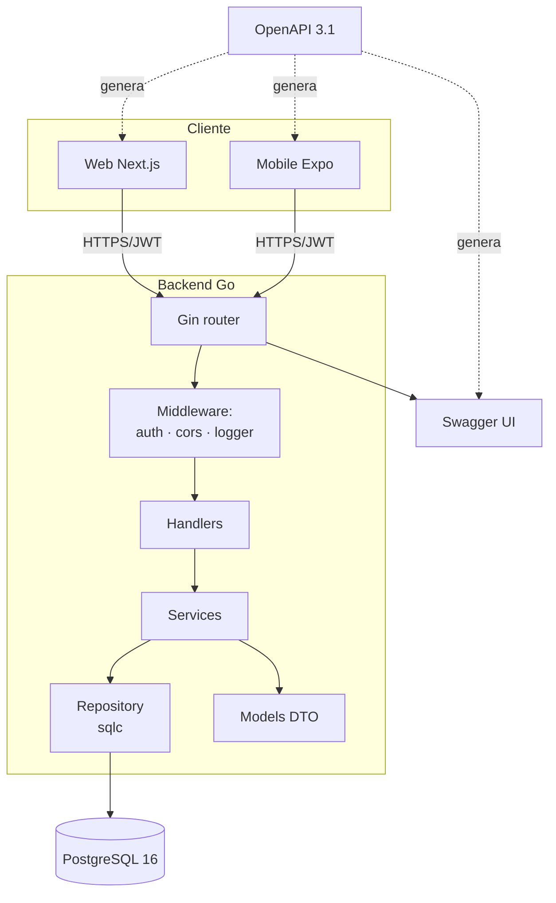
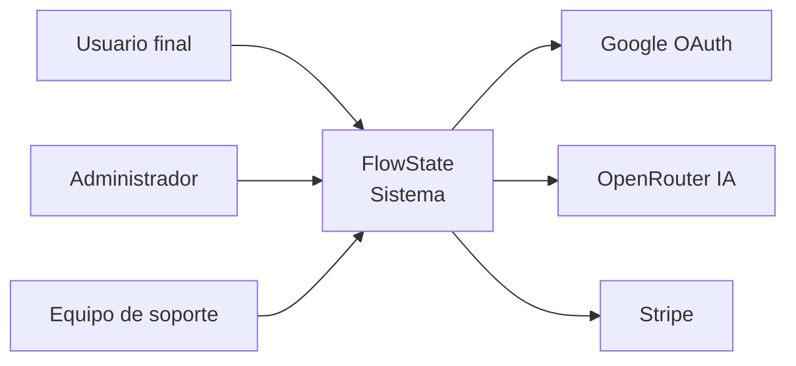
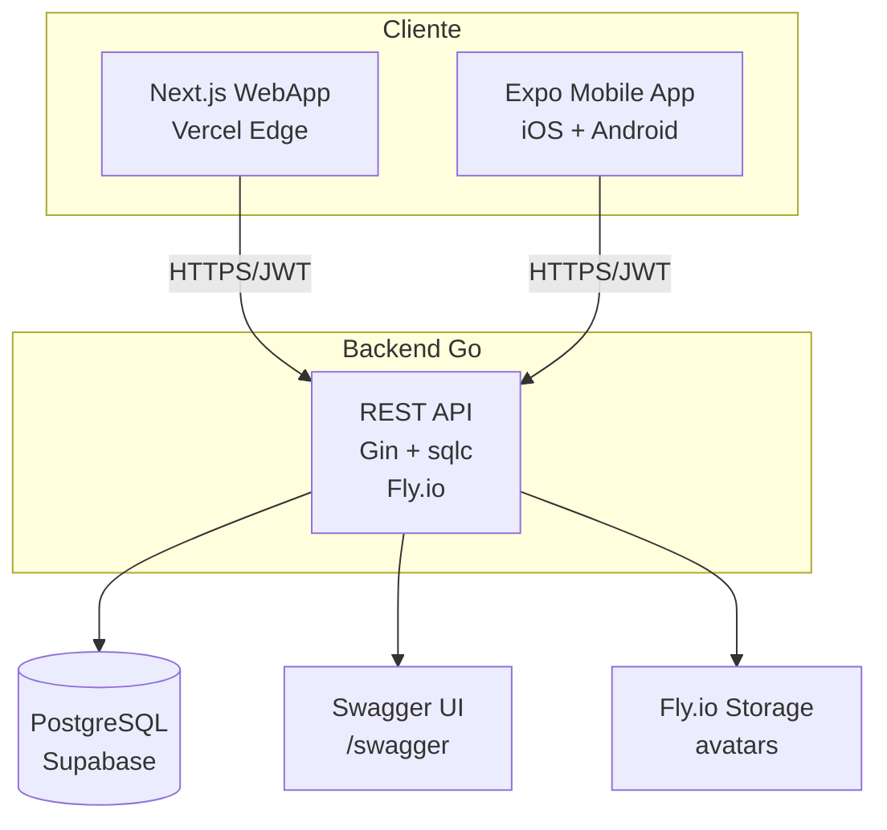
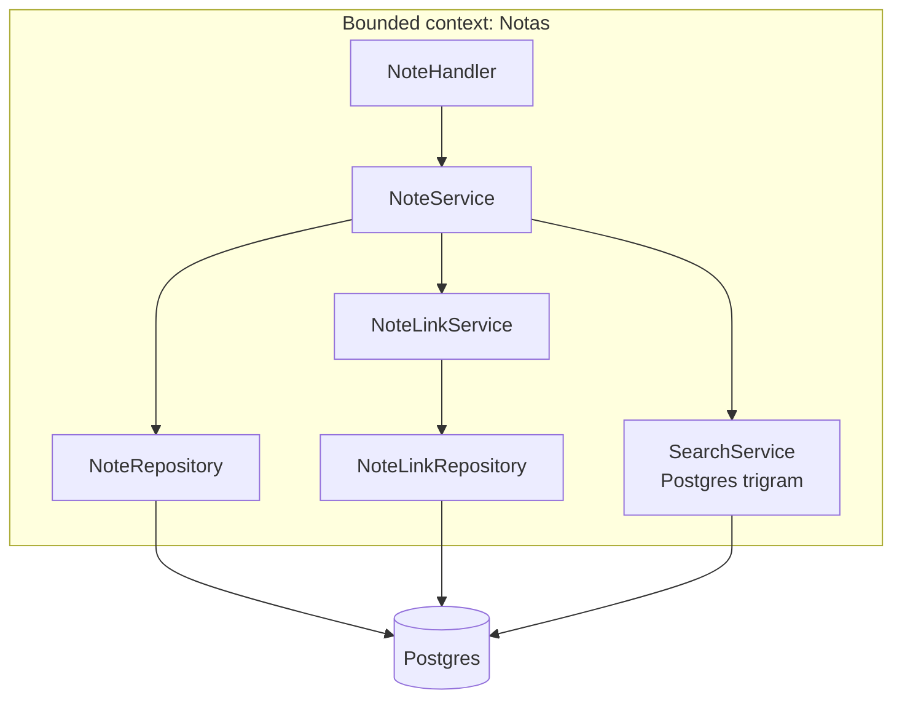
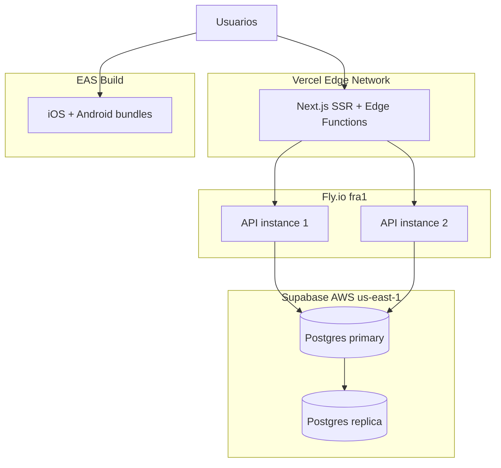

# FASE 6 — Arquitectura

<span class="chapter-marker">Fase 6 · Arquitectura</span>

## 6.1 Principios de desarrollo

El equipo suscribe los siguientes principios. Cada uno se aplica
explícitamente en las revisiones de código (PR template) y en la
definición de la arquitectura.

### 6.1.1 Principios SOLID

| Principio | Aplicación concreta en FlowState |
|---|---|
| **SRP — Single Responsibility** | Cada paquete Go tiene una única razón de cambio: `handler` (HTTP), `service` (casos de uso), `repository` (sqlc), `model` (DTOs). |
| **OCP — Open/Closed** | El router Gin se compone añadiendo `Route(...)` a un slice; los handlers nuevos no modifican código existente. |
| **LSP — Liskov Substitution** | `Repository` se define como interfaz; la implementación `PostgresRepository` y una futura `MemoryRepository` son intercambiables. |
| **ISP — Interface Segregation** | Los handlers sólo dependen de las interfaces que usan (`NoteReader`, `NoteWriter`), nunca del `Repository` completo. |
| **DIP — Dependency Inversion** | Los servicios reciben dependencias por constructor (inyección explícita); no hay `var global = ...`. |

### 6.1.2 Otros principios

| Principio | Aplicación |
|---|---|
| **DRY** | El contrato OpenAPI es la única fuente de verdad; los tipos TypeScript se generan con `openapi-typescript`. |
| **YAGNI** | No se construyen abstracciones para una "futura segunda base de datos"; cuando llegue, se abstrae. |
| **KISS** | Cada función hace una sola cosa en ≤ 50 líneas. |
| **Separation of Concerns** | Web/mobile/api comparten contrato, no código de lógica de negocio. |
| **Convention over Configuration** | Estructura de directorios fija, nombres de archivos predecibles. |
| **Fail Fast** | Validación de inputs en el handler antes de llegar al servicio. Errores tipados. |
| **Privacy by Design** | Datos mínimos; cifrado en reposo y tránsito; logs sin PII. |

## 6.2 Stack tecnológico (definitivo)

### 6.2.1 Stack del backend



#### Componentes

| Componente | Tecnología | Versión | Rol |
|---|---|---|---|
| **Lenguaje** | Go | 1.22+ | Compilado, tipado, alto rendimiento. |
| **Framework HTTP** | Gin | 1.10+ | Router + middlewares. |
| **Acceso a datos** | sqlc | 1.27+ | Genera código Go desde SQL. |
| **Driver Postgres** | pgx (vía sqlc) | 5.6+ | Driver nativo, pool incluido. |
| **Migraciones** | golang-migrate | 4.17+ | Up/down SQL versionado. |
| **JWT** | golang-jwt/jwt v5 | 5.2+ | Firma y validación. |
| **OAuth Google** | google.golang.org/api/oauth2 | latest | Validación de id_token. |
| **Logging** | zap | 1.27+ | Structured JSON logs. |
| **Validación** | go-playground/validator | 10+ | Tags en structs. |
| **Hash de contraseñas** | golang.org/x/crypto/bcrypt | latest | Cost 12. |
| **OpenAPI** | swaggo/swag | 1.16+ | Genera Swagger desde comentarios. |
| **Documentación** | Swagger UI embebido | 5+ | Sirve en `/swagger/index.html`. |
| **Testing** | testify | 1.9+ | Assertions + mocks. |
| **Mocks HTTP** | net/http/httptest | stdlib | Tests de handlers. |
| **Linter** | golangci-lint | 1.59+ | Ejecuta go vet, staticcheck, etc. |

### 6.2.2 Stack del frontend web

| Componente | Tecnología | Versión |
|---|---|---|
| Framework | Next.js | 16 |
| UI | React | 19 |
| Estilos | Tailwind CSS | 4 |
| Componentes | shadcn/ui | latest |
| Animaciones | reactbits.dev (TS-TW) | latest |
| Estado global | Zustand | 5 |
| Markdown | markdown-it | 14 |
| Visualización | d3-force, d3-selection | latest |
| Fuentes | Inter + JetBrains Mono (next/font) | — |
| Linter | Biome | 1.9+ |
| Tests | Playwright (E2E) | latest |

### 6.2.3 Stack móvil

| Componente | Tecnología | Versión |
|---|---|---|
| Runtime | Expo SDK | 56 |
| Framework | React Native | 0.85 |
| Router | expo-router | 4 |
| Storage seguro | expo-secure-store | 56 |
| DB local | expo-sqlite | 56 |
| Animaciones | react-native-reanimated | 4 |
| Tipos | openapi-typescript (generado) | 7+ |

### 6.2.4 Stack de infraestructura

| Servicio | Proveedor | Tier | Coste |
|---|---|---|---|
| Backend | Fly.io | Hobby/Pro | USD 12/mes |
| Frontend | Vercel | Pro | USD 20/mes |
| Base de datos | Supabase | Pro | USD 25/mes |
| Build móvil | EAS | Pay-as-you-go | USD 10/mes |
| Dominio | Namecheap / Cloudflare | — | USD 2/mes prorrateado |
| Email transaccional | Resend | Free | USD 0 |
| Monitoreo | Grafana Cloud | Free | USD 0 |

## 6.3 Estilo arquitectónico

FlowState adopta una **arquitectura en capas (layered) con tres capas
lógicas por bounded context**, expuesta como API REST:

```
┌────────────────────────────────────────────┐
│  Handler Layer (Gin)                       │  ← HTTP, validación, auth
├────────────────────────────────────────────┤
│  Service Layer (casos de uso)              │  ← reglas de negocio
├────────────────────────────────────────────┤
│  Repository Layer (sqlc)                   │  ← SQL puro + Go generado
└────────────────────────────────────────────┘
                │
                ▼
        ┌──────────────┐
        │  PostgreSQL  │
        └──────────────┘
```

### 6.3.1 Justificación del estilo

- **Simplicidad**: tres capas por bounded context son suficientes.
- **Testabilidad**: cada capa se testea en aislamiento.
- **Compatibilidad con sqlc**: el `Repository Layer` es la única capa que
  habla SQL; el resto trabaja en términos de structs Go.
- **Onboarding**: nuevos desarrolladores entienden la estructura en
  minutos.

### 6.3.2 Estructura de directorios del backend Go

```
apps/api/
├── cmd/
│   └── server/
│       └── main.go              # entrypoint, wiring
├── internal/
│   ├── config/                  # carga de env vars
│   ├── handler/                 # capa HTTP (Gin)
│   │   ├── auth.go
│   │   ├── notes.go
│   │   ├── teams.go
│   │   ├── goals.go
│   │   ├── tasks.go
│   │   ├── graph.go
│   │   └── notifications.go
│   ├── service/                 # casos de uso
│   │   ├── auth_service.go
│   │   ├── note_service.go
│   │   └── ...
│   ├── repository/              # interfaces
│   │   ├── note_repository.go
│   │   └── ...
│   ├── db/                      # sqlc output (generado)
│   │   ├── queries.sql.go
│   │   └── models.go
│   ├── middleware/              # auth, cors, logger, recovery
│   ├── model/                   # DTOs (request/response)
│   └── platform/                # postgres, redis, email
├── migrations/                  # archivos .up.sql / .down.sql
├── queries/                     # archivos .sql fuente para sqlc
├── docs/                        # OpenAPI generado por swag
├── sqlc.yaml
├── go.mod
└── go.sum
```

### 6.3.3 Patrón Repository con sqlc

```go
// repository/note_repository.go
type NoteRepository interface {
    Create(ctx context.Context, n CreateNoteParams) (Note, error)
    GetByID(ctx context.Context, id string) (Note, error)
    List(ctx context.Context, filter NoteFilter) ([]Note, error)
    Update(ctx context.Context, id string, patch UpdateNoteParams) (Note, error)
    Delete(ctx context.Context, id string) error
}

type noteRepo struct {
    q *db.Queries  // ← sqlc generated
}

func NewNoteRepository(q *db.Queries) NoteRepository {
    return &noteRepo{q: q}
}

func (r *noteRepo) Create(ctx context.Context, n CreateNoteParams) (Note, error) {
    row, err := r.q.InsertNote(ctx, db.InsertNoteParams{
        ID:       uuid.NewString(),
        Title:    n.Title,
        Content:  n.Content,
        AuthorID: n.AuthorID,
        // ...
    })
    if err != nil {
        return Note{}, fmt.Errorf("insert note: %w", err)
    }
    return toModel(row), nil
}
```

```sql
-- queries/notes.sql
-- name: InsertNote :one
INSERT INTO notes (id, title, content, author_id, team_id, tags, is_public, shared_with, created_at, updated_at)
VALUES ($1, $2, $3, $4, $5, $6, $7, $8, now(), now())
RETURNING *;
```

> **Decisión clave**: el SQL vive en archivos `.sql` revisables por
> cualquier miembro del equipo, no en strings Go. Esto hace el código
> audit-able por DBAs y soporta mejor las migraciones.

## 6.4 Diagramas C4

### 6.4.1 Diagrama de contexto (C1)



### 6.4.2 Diagrama de contenedores (C2)



### 6.4.3 Diagrama de componentes (C3) — bounded context de Notas



### 6.4.4 Diagrama de despliegue



## 6.5 Patrones aplicados

| Patrón | Dónde | Cómo |
|---|---|---|
| **Repository** | `internal/repository/*` | Interfaces + impl sqlc. |
| **Service Layer** | `internal/service/*` | Orquestación, transacciones. |
| **DTO** | `internal/model/*` | Separar modelo de DB de API. |
| **Middleware** | `internal/middleware/*` | Cross-cutting: auth, logging. |
| **Strategy** | `ai/provider/*` | Modelos OpenRouter intercambiables. |
| **Factory** | `cmd/server/main.go` | Wire-up de dependencias. |
| **Token rotation** | `auth/refresh` | Cada refresh emite un nuevo par. |
| **Optimistic locking** | `notes.updated_at` | Patch con `WHERE updated_at = ?`. |
| **Cursor pagination** | `?cursor=...` | Eficiente para listas largas. |
| **Circuit Breaker** | cliente OpenRouter | `sony/gobreaker` para IA. |
| **Soft delete** | `deleted_at` | Notas y tareas (recuperables). |
| **Wiki parser** | `service/note_links.go` | Regex + dedupe por `UNIQUE`. |

### 6.5.1 Generación de tipos desde OpenAPI

```bash
# Web
bunx openapi-typescript docs/api.yaml -o src/lib/api/types.ts

# Mobile
npm run gen:api   # openapi-typescript docs/api.yaml -o src/lib/api/types.ts

# Backend Go: los tipos de request/response se escriben a mano
# en internal/model/ pero se documentan vía comentarios Swagger
# que swag convierte a docs/openapi.yaml.
```

### 6.5.2 Manejo de errores

- **Capa repository**: devuelve `error` envuelto con `fmt.Errorf("...: %w", err)`.
- **Capa service**: traduce errores de dominio a errores de aplicación
  (ej. `ErrNoteNotFound`).
- **Capa handler**: mapea errores a status HTTP:
  - `ErrNoteNotFound` → `404 Not Found`
  - `ErrUnauthorized` → `401 Unauthorized`
  - `ErrForbidden` → `403 Forbidden`
  - `ErrValidation` → `400 Bad Request` con detalles
  - `ErrConflict` → `409 Conflict`
  - `ErrInternal` → `500 Internal Server Error` (log + id de correlación)

### 6.5.3 Configuración

Toda la configuración se carga de variables de entorno; nunca se
hardcodean valores:

```go
type Config struct {
    Port        string  // PORT
    DatabaseURL string  // DATABASE_URL
    JWTSecret   string  // JWT_SECRET
    AccessTTL   time.Duration  // ACCESS_TTL
    RefreshTTL  time.Duration  // REFRESH_TTL
    OpenRouterKey string  // OPENROUTER_API_KEY
    GoogleClientID string  // GOOGLE_CLIENT_ID
    Environment  string  // ENV (dev|staging|prod)
    LogLevel    string  // LOG_LEVEL
}

func Load() (*Config, error) {
    if err := godotenv.Load(); err != nil { /* optional */ }
    cfg := &Config{
        Port: getEnv("PORT", "8080"),
        // ...
    }
    if cfg.JWTSecret == "" {
        return nil, errors.New("JWT_SECRET is required")
    }
    return cfg, nil
}
```